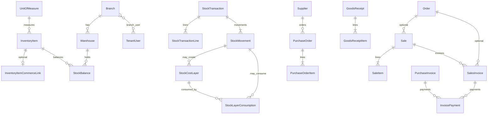

# ERP Core — Architecture

## Goal

Tenant-side ERP core: branches, warehouses, FIFO inventory, purchases, sales, invoices, and basic payments — **without** syncing continuously to the e-commerce product quantities.

## Boundaries

**In scope:** master data, stock documents, FIFO costing, suppliers/PO/GR/purchase invoices/returns, mixed sales, sales invoices (`order_id` FK), sales returns, invoice payments, Filament Tenant UI, tests, docs.

**Out of scope:** plan features/limits, POS, Meta messaging, payroll, full accounting/GL, automatic Order→Sale, continuous commerce↔ERP sync, **server-generated PDF** (browser print-ready HTML is implemented — see [`docs/erp-invoice-printing.md`](docs/erp-invoice-printing.md)).

## Commerce vs ERP separation

| System | Storage | Updated by |
|---|---|---|
| Store | `products.quantity`, `product_variants.quantity` (integer) | Checkout/Orders; **and** explicit ERP Actions when a receipt/return line is `commerce` |
| ERP | `stock_balances`, movements, FIFO layers | Stock posting Actions only |

**No Model Observers / `boot()` hooks** adjust the other system. Cross-impact is always explicit inside Actions (`PostStockTransactionAction`, `PostGoodsReceiptAction`, `ConfirmSaleAction`, return Actions) and audited in `commerce_quantity_adjustments` with idempotency keys.

Optional link: `inventory_item_commerce_links` (unique per store source, unique per inventory item).

## Relationship diagram

## Document statuses

Stock/GR/returns: `draft` → `posted` → `reversed` (or `cancelled` for drafts only).  
PO: draft → approved → partially_received → received | cancelled | closed.  
Sale: draft → confirmed → partially_invoiced → invoiced (+ return/reverse states).  
Invoices: draft → issued → partially_paid → paid (+ overdue/refund states prepared).

## FIFO

1. Inbound posted movements create `stock_cost_layers` (remaining = original).
2. Outbound uses `lockForUpdate()`, order by `received_at`, `id`.
3. Writes `stock_layer_consumptions`; updates layer remaining/status.
4. Insufficient qty → ValidationException; whole DB transaction rolls back.
5. Transfers consume source layers and recreate **same unit costs** at destination (not averaged).
6. Sale returns restock using original consumption costs when available.

Math: `App\Support\Erp\Decimal` (BCMath). Money scale 2; qty/cost scale 4.

## Sales flow

Draft mixed lines (inventory | commerce | manual) → `ConfirmSaleAction` (idempotent) → optional `CreateSalesInvoiceAction` (partial allowed; copies `sale.order_id`; not unique) → `RecordInvoicePaymentAction`.

Inventory lines: ERP FIFO only. Commerce: store qty only. Manual: neither.

## Purchases flow

PO approve (no stock) → Goods Receipt post (stock + FIFO + optional commerce) → Purchase Invoice (no stock) → payments. Returns consume original receipt layers when linked.

## Future Order link

`sales.order_id` and `sales_invoices.order_id` exist. Active sale uniqueness per order enforced in `ConfirmSaleAction`. No auto conversion.

## Deferred

POS, weighted average costing, GL/journals, plan gates, continuous sync, **server-side PDF libraries**, credit notes full accounting.

## Invoice printing

Print-ready HTML for sales/purchase invoices with singleton `invoice_print_settings`, historical `print_settings_snapshot`, and Filament print actions. Details: [`docs/erp-invoice-printing.md`](docs/erp-invoice-printing.md).
