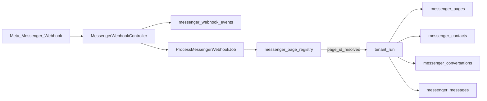

# Messenger Messaging Module Documentation

Developer handoff document for the **Facebook Messenger** CRM channel in the Techno Online Store multi-tenant platform.

**Status:** Phases A–F complete (manual Messenger **staging E2E passed**). **Phase G code-complete** (Facebook Login for Business + Page picker + auto Page webhook subscription). Phase G staging E2E pending. **Meta App / Access Verification public pages delivered** (legal URLs + SaaS `/` + `/platform` + company static pack).  
**Related:** WhatsApp is a separate channel — see [`docs/whatsapp-messaging-module.md`](whatsapp-messaging-module.md). Do not mix tables, services, or routes. Platform ops dashboard: [`docs/messaging-health-dashboard.md`](messaging-health-dashboard.md).

---

## Changelog

| Date | Change |
|---|---|
| 2026-07-20 | Docs completeness: inventory for public legal + Access Verification pages; document central `GET /` home landing; tenant `GET /` conflict → 404 gotcha; company pack logo/animations; `AGENTS.md` index update. |
| 2026-07-20 | Fix: central home `GET /` returned 404 because tenant `routes/tenant.php` overwrote it and `PreventAccessFromCentralDomains` aborted on central domains. Home now uses `PlatformLandingController`; tenant placeholder `/` removed. |
| 2026-07-19 | Company static landing polish: Techno Web Masr logo (`logo.png`), dark brand theme, scroll/logo motion (`public-delivery/techno-online-store/`). |
| 2026-07-19 | Meta Access Verification landing pages: SaaS `/platform` (central domain) + standalone company site pack in `public-delivery/techno-online-store/`. Cross-links to contact, privacy, terms, data deletion. No messaging logic changes. |
| 2026-07-13 | Meta App readiness: public central-domain Privacy Policy, Terms of Service, and Data Deletion pages (`/privacy-policy`, `/terms-of-service`, `/data-deletion`) + App Domains / OAuth / legal URL checklist. No Messenger onboarding logic changes. |
| 2026-07-13 | Phase G implemented: Facebook Login for Business + Page picker + automatic Page `subscribed_apps`; Connect Messenger tenant UI (manual remains); central onboarding routes; encrypted onboarding sessions; docs + Phase G tests. Instagram/Orders/campaigns still out of scope. |
| 2026-07-12 | Staging E2E confirmed: Page webhook inbound, contact profile lookup, CRM inbox customer name, CRM reply inside 24h window, admin diagnostics for processed events. Phase G still not started. |
| 2026-07-12 | Feature: tenant Outgoing API Log for Messenger (`messenger_api_requests`) — status explanation, request payload, Meta response; inbox shows contact profile picture with initials fallback. |
| 2026-07-12 | Bugfix: `messenger_contacts.profile_picture_url` changed to nullable TEXT (Facebook `profile_pic` CDN URLs often exceed 255 chars and caused SQLSTATE[22001]). |
| 2026-07-12 | Enhancement: fetch Messenger user profile by PSID on inbound (`MessengerUserProfileService`); store `profile_name` / `profile_picture_url`; inbox shows name with PSID fallback. Profile failures do not block webhook processing. |
| 2026-07-12 | Phase F: test hardening (verification edges, reprocess safety, redaction/masking, permission bypass), docs polish, staging E2E checklist, AGENTS index update. No Facebook Login / new UI features. |
| 2026-07-12 | Phase E implemented: admin `MessengerPageResource` (registry, no tokens), admin webhook events (read-only + optional reprocess), admin `MessengerInboxPage` with tenant selector safety (`MessengerTenantContextService`). No OAuth / unified inbox. |
| 2026-07-12 | Phase D implemented: tenant Filament `MessengerPageResource`, `MessengerInboxPage`, `MessengerWebhookEventResource` (tenant-scoped, read-only). Manual page connect with masked token; inbox reply via Phase C send + 24h policy. No Admin UI / OAuth. |
| 2026-07-12 | Phase C implemented: `MessengerGraphApiService`, `MessengerSendingPolicyService`, `SendMessengerTextMessageAction` (text only, 24h window, auth → reconnect_required). No Filament UI / OAuth / tags / campaigns. |
| 2026-07-12 | Phase B implemented: Messenger webhook routes/controller, signature verify, central event store, `ProcessMessengerWebhookJob`, page_id resolver, inbound text processor (contact/conversation/message + 24h window), diagnostics statuses, Phase B tests. No send/UI/OAuth. |
| 2026-07-12 | Phase A implemented: central/tenant migrations, models, enums, registry sync observer, permission keys, Phase A tests. No webhooks/UI/send yet. |
| 2026-07-12 | Full Messenger implementation plan documented. No application code. Awaiting separate approval before Phase A (schema). |

---

## Phase G delivered

### Facebook Login for Business (Messenger Pages only)
- **Config** (`config/messenger.php` + `.env.example`):
  - `MESSENGER_FACEBOOK_LOGIN_CONFIG_ID` — Meta Login for Business config
  - `MESSENGER_OAUTH_REDIRECT_URI` — central callback URL
  - `MESSENGER_OAUTH_SCOPES` — default `pages_show_list,pages_manage_metadata,pages_messaging`
  - Reuses `META_APP_ID` / `META_APP_SECRET` and `MESSENGER_GRAPH_API_VERSION`
  - Central host: `MESSENGER_ONBOARDING_CENTRAL_DOMAIN` (defaults like WhatsApp central domain)
- **Permissions requested:** Messenger Page scopes only — **no** WhatsApp, Instagram, or ads permissions
- **Tenant UI:** `ConnectMessengerPage` — Option A Manual (unchanged create form), Option B Facebook Login
  - Missing config → configuration required; OAuth is **not** launched
- **Central routes** (central domain middleware):
  - `GET /messenger/onboarding/start`
  - `GET /messenger/onboarding/callback`
  - `GET /messenger/onboarding/pages` (Page picker)
  - `POST /messenger/onboarding/connect`
  - `GET /messenger/onboarding/status`
- **Signed state** (`MessengerOnboardingStateService`): `tenant_id`, `tenant_user_id`, `nonce`, `issued_at` / `expires_at`, `return_url` — encrypted; raw `tenant_id` rejected
- **Callback:** server-side code → user token exchange (secret never in browser); list `/me/accounts`; discard user token; keep Page tokens encrypted in short-lived `messenger_onboarding_sessions` until connect
- **Connect:** upsert tenant `MessengerPage` (`connection_method=facebook_login`, `token_source=facebook_login`, encrypted `page_access_token`); sync central registry metadata **without** tokens; `POST /{page-id}/subscribed_apps`
- **Subscribed fields** (configurable): `messages`, `messaging_postbacks`, `message_deliveries`, `message_reads`, `messaging_seen`
- **Failure:** webhook not marked `subscribed`; page `reconnect_required` + safe error; retry subscription action on edit; reconnect via Connect page
- **Manual path:** unchanged and still available

### Phase G staging E2E checklist
- [ ] Meta Login for Business config created with Messenger Page scopes only
- [ ] `MESSENGER_FACEBOOK_LOGIN_CONFIG_ID`, redirect URI, `META_APP_ID` / `META_APP_SECRET` set on staging
- [ ] Central domain hosts `/messenger/onboarding/*` and is allowlisted in Meta
- [ ] Tenant → Connect Messenger → Facebook Login launches on central domain
- [ ] Page picker lists manageable Pages (name + page_id); tokens never visible in UI
- [ ] Selecting Page(s) creates/updates tenant page; registry has metadata only
- [ ] Page `subscribed_apps` succeeds → `webhook_status=subscribed`
- [ ] Inbound Messenger message still routes and shows in CRM inbox
- [ ] CRM reply inside 24h still works
- [ ] Subscription failure shows reconnect / retry without marking subscribed
- [ ] Manual Page connection still works alongside Facebook Login

### Not in Phase G
Instagram, WhatsApp changes, Orders, campaigns, unified inbox, cold outbound / message tags, attachment send, queue architecture changes.

---

## Phase F delivered

### Test hardening
- Verification: correct/wrong/underscore/trim/empty token/non-subscribe mode
- Inbound: invalid signature, happy path, unresolved `page_id`, duplicate `mid`, tenant isolation
- Send: inside/outside 24h, inactive pages, Graph auth → `reconnect_required`, token encryption
- Tenant UI: masked token / empty edit keep, inbox reply block outside window
- Admin: registry no tokens, webhook read-only, tenant selector clear/switch, reply via send action
- Reprocess: original payload, `invalid_signature` blocked, forged payload `tenant_id` ignored
- Safety: payload redactor, logger masking, permission bypass behavior

### Docs / env / index
- This document: delivered inventory, staging setup, E2E checklist, troubleshooting, 24h policy, not-implemented list
- `AGENTS.md` docs index updated
- `.env.example` Messenger keys confirmed (`MESSENGER_WEBHOOK_VERIFY_TOKEN`, shared `META_APP_SECRET`, Graph version, etc.)

### Safety audit (confirmed)
| Rule | Status |
|---|---|
| No `page_access_token` in central registry | OK |
| No tokens in webhook event schema / redacted payloads | OK |
| Logs mask verify tokens / signature headers; Graph logs status/code only | OK |
| Tenant resolved only via `page_id` → `messenger_page_registry` | OK |
| Payload `tenant_id` never trusted | OK |
| Admin inbox requires tenant selection; clear/switch ends context | OK |
| WhatsApp application code untouched by Messenger phases | OK |

---

## Phase E delivered

### Admin Filament UI
- **Registry:** `App\Filament\Resources\MessengerPages\MessengerPageResource` on central `MessengerPageRegistry`
  - List/search/filter: tenant, page_id, status, is_active, inbound/outbound/health timestamps
  - **No** `page_access_token` column or form field
  - Safe enable/disable via `SyncMessengerPageStatusAction` (updates tenant page then re-syncs registry)
- **Webhooks:** `App\Filament\Resources\MessengerWebhookEvents\MessengerWebhookEventResource`
  - Read-only create/edit/delete; filters: processing_status, tenant_id, page_id, event_type, signature_valid
  - View diagnostics/payload; raw payload gated by `messenger.platform.troubleshoot` (or bypass)
  - Optional reprocess via `ReprocessMessengerWebhookAction` → existing `ProcessMessengerWebhookJob` when `canReprocess()`
- **Inbox:** `App\Filament\Pages\MessengerInboxPage`
  - Requires tenant selection before any tenant DB query
  - `mount` / `hydrate` initialize; `dehydrate` + clear/switch end context via `MessengerTenantContextService`
  - Replies use `SendMessengerTextMessageAction` (same as tenant inbox)
  - Not a central operational inbox — support diagnostics only

### Tenant selector safety
1. Empty selection → empty state UI; computed inbox queries return empty if `!tenancy()->initialized`
2. Select tenant → end previous context → `initializeForTenant`
3. Clear/switch → reset conversation state; end or re-init context
4. Never trust cross-tenant conversation IDs after switch

### Permissions
`messenger.platform.view_all_pages`, `manage_all_pages`, `view_webhook_events`, `troubleshoot` (bypass respected)

### Not in Phase E
Facebook Login, Page picker, Instagram, Orders, campaigns, unified inbox, WhatsApp changes.

---

## Phase D delivered

### Tenant Filament UI
- **Pages:** `App\Filament\Tenant\Resources\MessengerPages\MessengerPageResource` (+ Create/Edit/List)
  - Manual connect: `page_id`, `page_name`, `page_access_token` (password, never revealed full), status, webhook_status, is_default, is_active
  - Diagnostics (edit): last inbound/outbound/error, connected/disconnected/reconnect timestamps
  - Empty token on edit keeps existing encrypted token; registry sync via existing observer (no token centrally)
  - Actions: set default, disable, disconnect (keeps conversations/messages)
- **Inbox:** `App\Filament\Tenant\Pages\MessengerInboxPage` + shared concern/view
  - Conversation list + thread; page name; PSID/profile name; **profile picture** (CDN URL) with initials fallback; 24h open/closed badge
  - Reply only when `MessengerSendingPolicyService` allows; uses `SendMessengerTextMessageAction`
  - Outside window: clear alert, **no Graph call**; no tags/campaigns/attachments/cold outbound
- **Outgoing API Log:** `App\Filament\Tenant\Resources\MessengerApiRequests\MessengerApiRequestResource`
  - Tenant table `messenger_api_requests`: outcome, status explanation, request payload, Meta response (tokens never stored)
- **Webhooks:** `App\Filament\Tenant\Resources\MessengerWebhookEvents\MessengerWebhookEventResource`
  - Central `MessengerWebhookEvent` filtered to current `tenant_id`; read-only; filters status/page_id/event_type

### Shared / nav
- `App\Filament\Shared\Messenger\...` (form, tables, permission + inbox concerns)
- Navigation group `dashboard.messenger_group` (sort 50–53); WhatsApp nav untouched
- Permissions: `messenger.view_pages`, `manage_pages`, `view_inbox`, `send_messages`, `view_webhook_events` (bypass respected via `ChecksMessengerPermissions` / Gate)

### Not in Phase D
Admin Messenger UI, Facebook Login, reprocess webhook action, Instagram, Orders, campaigns, WhatsApp changes.

---

## Phase C delivered

### Services / actions
- `App\Messenger\Services\MessengerGraphApiService` — `POST /{page-id}/messages` text send; Graph version from `config/messenger.php`; never logs `page_access_token`
- `App\Messenger\Services\MessengerSendingPolicyService` — freeform text only inside open 24h window; blocks inactive/disabled/reconnect_required/failed pages and page/conversation mismatch
- `App\Messenger\DTOs\MessengerSendingPolicyResult`
- `App\Messenger\Actions\SendMessengerTextMessageAction` — policy → Graph → persist outbound message → update conversation/page → registry sync

### Send flow (service level)
1. Resolve `messenger_page` from conversation (tenant DB token only)
2. `canSendText` must allow (active page + ownership + window open)
3. Create pending outbound `messenger_messages` row
4. Graph send with Page access token (`messaging_type: RESPONSE`)
5. On success: mark sent, update previews/`last_outbound_at`, sync registry metadata
6. On Graph auth error (HTTP 401 or codes 190/102): page → `reconnect_required`, set `reconnect_required_at` + safe `last_error_message`, sync registry; message → failed
7. Outside window / bad page → exception **before** Graph call

### Not in Phase C
Filament inbox/UI, Facebook Login, message tags, cold outbound, attachments, Instagram, Orders, campaigns, WhatsApp changes.

---

## Phase B delivered

### Routes (`routes/web.php`)
- `GET /webhooks/meta/messenger` — Meta verification (`hub.mode` / `hub.verify_token` / `hub.challenge`, underscore fallback)
- `POST /webhooks/meta/messenger` — receive + enqueue processing

### Controller
- `App\Http\Controllers\MessengerWebhookController`
- Verify token from `MESSENGER_WEBHOOK_VERIFY_TOKEN` (`config/messenger.php`)
- POST verifies `X-Hub-Signature-256` with `META_APP_SECRET`
- Invalid signature → central event `rejected`, HTTP 403
- Valid body → store `messenger_webhook_events` (`pending`), dispatch job, HTTP 200

### Job / resolver / inbound
- `App\Messenger\Jobs\ProcessMessengerWebhookJob`
- `App\Messenger\Services\MessengerWebhookResolver` — resolve tenant by `page_id` from `messenger_page_registry` only (never trust payload `tenant_id`)
- `App\Messenger\Actions\ProcessInboundMessengerMessageAction` (+ upsert contact, find/create conversation, open 24h window, registry sync)
- Idempotent on `provider_message_id` (`message.mid`)
- Statuses: `pending`, `processed`, `failed`, `unresolved`, `rejected`
- Unresolved unknown `page_id`; failed stores safe `error_message`; payloads redacted per retention

### Config / env
- `config/messenger.php`
- `MESSENGER_WEBHOOK_VERIFY_TOKEN`, `MESSENGER_ALLOW_UNSIGNED_WEBHOOKS`, shared `META_APP_SECRET`

### Not in Phase B
Send API, outbound replies, Filament inbox/pages, Facebook Login, Instagram, Orders, campaigns, WhatsApp changes.

---

## Phase A delivered

### Central tables
- `messenger_page_registry` — routing/metadata only (no tokens)
- `messenger_webhook_events` — schema ready; **no processing** until Phase B

### Tenant tables
- `messenger_pages`, `messenger_contacts`, `messenger_conversations`, `messenger_messages`

### Models
- Central: `App\Models\MessengerPageRegistry`, `App\Models\MessengerWebhookEvent`
- Tenant: `App\Models\Tenant\MessengerPage`, `MessengerContact`, `MessengerConversation`, `MessengerMessage`

### Enums (`App\Messenger\Enums\`)
- `MessengerPageStatus`, `MessengerWebhookProcessingStatus`, `MessengerTokenSource`, `MessengerConnectionMethod`
- `MessengerMessageDirection`, `MessengerMessageStatus`, `MessengerMessageType`, `MessengerMessageSenderType`
- `MessengerConversationStatus`

### Sync
- `App\Observers\Tenant\MessengerPageObserver`
- `App\Messenger\Actions\SyncMessengerPageRegistryAction`

### Permissions
- Tenant: `messenger.view_pages`, `manage_pages`, `view_inbox`, `send_messages`, `view_webhook_events`
- Admin: `messenger.platform.view_all_pages`, `manage_all_pages`, `view_webhook_events`, `troubleshoot`

### Not in Phase A
Webhooks, routes, controllers, jobs, send API, Filament UI, Facebook Login.

---

## 1. Purpose

Build Messenger integration so each merchant (tenant) can:

- Connect one or more **Facebook Pages**
- Receive inbound Messenger messages via Meta webhooks
- Reply from the tenant CRM inbox
- Create/update contacts from Messenger interactions (PSID)
- Keep all operational Messenger data isolated in the tenant database

**Billing assumption:** Merchants own their Facebook Page / Meta assets; the platform stores Page access tokens only for messaging (same model as WhatsApp).

### Explicit non-goals (this initiative)

- Do **not** modify the WhatsApp module or its tables
- Do **not** implement Instagram yet (design for a similar future pattern only)
- Do **not** implement Orders or order notifications
- Do **not** implement campaigns / bulk sending
- Do **not** change queue architecture
- Do **not** change the hybrid central + tenant storage architecture
- Do **not** create a central operational inbox of conversations/messages

---

## 2. Business requirements

| Requirement | Decision |
|---|---|
| Multi-page per tenant | Supported |
| Inbound → CRM | Via global webhook + registry routing |
| Outbound from CRM | Page access token + Send API to PSID |
| Contacts | Upsert from interactions only — **no** Page follower import |
| Tenant isolation | Mandatory (DB + services + Filament) |
| Admin access | Tenant selector + initialize tenant context (like WhatsApp admin inbox) |
| Connection MVP | Manual `page_id` + `page_name` + `page_access_token` |
| Self-serve onboarding | Facebook Login + Page selection + webhook subscribe (**Phase G delivered**) |
| Manual path | Remains for admins/developers |

---

## 3. Architecture decision: Hybrid central + tenant DB

Mirror the WhatsApp hybrid approach. Meta delivers webhooks to **one global HTTPS endpoint** before the app knows which tenant owns the `page_id`.



### Central DB stores

| Table / data | Purpose |
|---|---|
| `messenger_page_registry` | Maps `page_id` → `tenant_id` + tenant-local page ID |
| `messenger_webhook_events` | Raw/minimized payloads, processing status, diagnostics |
| Registry metadata | Connection/health flags (no tokens) |
| Unresolved events | Unknown or unmapped `page_id` |

### Tenant DB stores (per merchant)

| Table | Purpose |
|---|---|
| `messenger_pages` | Connected Pages + **encrypted** Page access tokens |
| `messenger_contacts` | Customers keyed by PSID |
| `messenger_conversations` | Inbox threads + 24h window |
| `messenger_messages` | Inbound/outbound timeline |
| `messenger_api_requests` | Outbound Graph API request log (status, payload, response) |

### Why hybrid?

```
Meta webhook (global URL)
  → store event centrally
  → resolve page_id in central registry
  → tenancy()->initialize($tenant) / $tenant->run()
  → write conversation/message in that tenant’s DB
```

### Explicit architectural decisions

1. **Separate channel namespaces** — do not reuse WhatsApp tables or `App\WhatsApp\*` services.
2. **No central mirror** of conversations or messages.
3. **Resolve tenant only by `page_id`** — never trust `tenant_id` from the webhook payload.
4. **Tokens only in tenant DB**, encrypted, hidden, masked in UI.
5. **Duplicate channel code** under `App\Messenger\*`; share only thin utilities (e.g. HMAC signature verify pattern) if extracted safely.
6. Staging may keep `QUEUE_CONNECTION=sync`; production can use database/redis later — **no architecture change required for MVP**.

---

## 4. WhatsApp pattern reuse

| Pattern | Reuse as |
|---|---|
| Registry sync observer | `MessengerPageObserver` → `SyncMessengerPageRegistryAction` |
| Webhook ingest | Controller → central event → job → resolve → `$tenant->run()` |
| 24h customer service window | Same idea on `messenger_conversations` |
| Token encryption / mask / empty-on-edit keep | Same UX and casts on `page_access_token` |
| Admin tenant selector | Same init/end safety as WhatsApp admin pages |
| Message status transitions | Delivery/read if subscribed (no downgrade) |
| Human-readable webhook interpretation | Optional parallel to WhatsApp event logging |
| Permission bypass during development | Same `BYPASS_PERMISSIONS` project rule |

**Do not generalize** into a single “omni-channel” module in this phase.

---

## 5. Data model (planned)

### Central: `messenger_page_registry`

- `tenant_id`, `tenant_messenger_page_id`
- `page_id` (unique globally), `page_name` nullable
- `status`, `webhook_status`, `is_default`, `is_active`
- `last_inbound_at`, `last_outbound_at`, `last_health_check_at`
- Optional non-secret mirrors: `connection_method`, `token_source`
- **No `page_access_token`**

### Central: `messenger_webhook_events`

- `provider` default `meta`
- `event_type`, `page_id`, `tenant_id`
- `processing_status`: `pending` | `processed` | `failed` | `unresolved` | `rejected`
- `payload`, `original_payload`, `payload_redacted`
- `summary`, `interpretation` (human-readable)
- `signature_valid`, `diagnostic_data`, `error_message`, `processed_at`

### Tenant: `messenger_pages`

Required fields:

- `page_id`, `page_name`
- `page_access_token` (encrypted)
- `token_source` (MVP: `manual`)
- `connection_method` (MVP: `manual`)
- `status` (`active` | `disabled` | `reconnect_required` | `failed`)
- `webhook_status`, `is_default`, `is_active`
- `last_inbound_at`, `last_outbound_at`, `last_error_message`
- Recommended: `connected_at`, `disconnected_at`, `reconnect_required_at`

### Tenant: `messenger_contacts`

- `psid` (unique), `profile_name` nullable
- `profile_picture_url` nullable **TEXT** (Facebook CDN URLs often exceed 255 characters)
- `last_message_at`

### Tenant: `messenger_conversations`

- Unique `(messenger_page_id, sender_psid)`
- Optional `contact_id`, assignment, status
- Previews + `customer_service_window_expires_at` / `last_customer_message_at`

### Tenant: `messenger_messages`

- Conversation + page FKs, direction, type, body
- `provider_message_id` (mid), status, timestamps, safe error fields
- Idempotent on inbound mid

---

## 6. Webhook flow

**Routes (new; WhatsApp routes untouched):**

- `GET /webhooks/meta/messenger` — verification
- `POST /webhooks/meta/messenger` — receive

**GET:** Validate `hub.mode` / `hub.verify_token` / `hub.challenge` against `MESSENGER_WEBHOOK_VERIFY_TOKEN` (dedicated env; preferred).

**POST:**

1. Verify `X-Hub-Signature-256` with `META_APP_SECRET`
2. Store central `messenger_webhook_events` (`pending`, keep `original_payload`)
3. Extract `page_id` from `entry[].id` (`object: page`)
4. Dispatch `ProcessMessengerWebhookJob` (works under `QUEUE_CONNECTION=sync`)
5. Return 200

**Job:**

1. Resolve registry by `page_id` → else `unresolved`
2. `$tenant->run()`: load page, upsert contact (PSID), find/create conversation, store message, open 24h window
3. Mark `processed` + redact per retention policy; on exception → `failed`

Subscribe Page fields (Meta App Dashboard): at minimum `messages`; add deliveries/reads/postbacks as phases require.

---

## 7. Sending flow

**Phase C (implemented at service/action layer — no Filament UI yet):**

1. Caller invokes `SendMessengerTextMessageAction` with a `MessengerConversation` + text body (+ optional acting user for sender_type)
2. Page resolved from conversation; Page access token read from **tenant** `messenger_pages` only
3. `MessengerSendingPolicyService::canSendText` — active page, conversation ownership, **inside 24h window**
4. Outside window → **block freeform before Graph**; no message tags / campaigns in this initiative
5. `MessengerGraphApiService::sendText` → `POST /{page-id}/messages` (`messaging_type: RESPONSE`)
6. Persist outbound message; update conversation; sync registry metadata (no token centrally)
7. Auth failures → `reconnect_required` + `reconnect_required_at` (never log the token)

Reply-page switching remains a later enhancement; tenant inbox UX is delivered in Phase D (text replies only).

---

## 8. Contact sync behavior

| Do | Do not |
|---|---|
| Upsert contact on Messenger interactions (PSID) | Import all Page followers/fans |
| Fetch Graph user profile on inbound when possible (`GET /{PSID}?fields=first_name,last_name,name,profile_pic`) using **Page** access token | Fail webhook processing if profile lookup fails |
| Store `profile_name` (+ `profile_picture_url` when returned) | Assume phone/email exists |
| Fall back to PSID in CRM UI when name is unavailable | Log Page access tokens |

### Profile lookup notes
- Implemented by `MessengerUserProfileService` during `ProcessInboundMessengerMessageAction`
- Meta may require `pages_messaging` / related permissions; some apps need **App Review** before profile fields return for users who messaged the Page
- If Graph returns an error (permission, privacy, rate limit), inbound message/contact/conversation still persist; display uses PSID until a later successful lookup

---

## 9. Multi-page per tenant

- Multiple Facebook Pages per tenant
- One default page (`is_default`) for entry points that need a default
- Conversation identity = **`messenger_page_id + sender_psid`**
- Same person messaging two Pages = two conversations
- Switching reply page creates/finds the correct conversation (WhatsApp reply-number parallel)
- `page_id` unique in central registry across the platform

---

## 10. Onboarding / connection methods

### MVP — Manual

Filament form: `page_id`, `page_name`, `page_access_token`  
Defaults: `token_source=manual`, `connection_method=manual`  
Observer → central registry sync (metadata only)

### Phase G — Facebook Login / Page selection (delivered)

1. Tenant **Connect Messenger** → Facebook Login (central domain)  
2. Signed state issued (never trust raw `tenant_id`)  
3. Facebook Login for Business with Page scopes  
4. Callback exchanges code server-side; lists manageable Pages (`/me/accounts`)  
5. Merchant confirms Page(s) in picker  
6. Store **Page** access token encrypted in tenant DB only (`facebook_login`)  
7. Subscribe Page via `POST /{page-id}/subscribed_apps`  
8. Mark `webhook_status=subscribed` / `status=active` on success; reconnect/retry on failure  

Manual connection **remains** for development and admin support.

**Central domain:** OAuth start/callback/picker/status run on `MESSENGER_ONBOARDING_CENTRAL_DOMAIN` so tenant subdomains need not be listed in Meta Allowed Domains.

---

## 11. Permissions (planned keys)

### Tenant

- `messenger.view_pages`
- `messenger.manage_pages`
- `messenger.view_inbox`
- `messenger.send_messages`
- `messenger.view_webhook_events`

### Admin (platform)

- `messenger.platform.view_all_pages`
- `messenger.platform.manage_all_pages`
- `messenger.platform.view_webhook_events`
- `messenger.platform.troubleshoot`

During active development, project may still use `BYPASS_PERMISSIONS` — feature behavior first; wire `can*()` in a hardening pass (same rule as WhatsApp).

---

## 12. Filament UI (planned)

### Tenant panel (`/app`)

- `MessengerPageResource` — manual connect CRUD, default, disconnect
- `MessengerInboxPage` — conversations + thread + reply
- `MessengerWebhookEventResource` — filtered to current `tenant_id`

### Admin panel (`/admin`)

- `MessengerPageRegistryResource` — list / enable / disable (**no tokens**)
- `MessengerWebhookEventResource` — all tenants + filters
- `MessengerInboxPage` — **requires tenant selector**; initialize/end tenant context

---

## 13. Security

- Encrypt `page_access_token`; `$hidden`; mask in UI; empty token on edit keeps existing
- Never store tokens in central DB or webhook payloads retained longer than needed
- Never log Authorization headers or raw tokens
- Signature verification required when `META_APP_SECRET` is set
- Resolve tenant **only** via `page_id` → `messenger_page_registry`
- Dedicated Messenger verify token recommended

---

## 14. Tests (planned)

| Area | Assert |
|---|---|
| Webhook verification | Valid challenge / invalid 403 |
| Inbound | Contact + conversation + message + window open |
| Duplicate mid | No duplicate messages |
| Unresolved `page_id` | Event unresolved; no tenant write |
| Tenant isolation | Cross-tenant invisibility |
| Send inside 24h | Allowed + Graph fake |
| Send outside 24h | Policy deny; no Graph call |
| Token | Hidden + encrypted; absent from registry |
| Admin selector | No tenant DB access before init; cleanup on switch |

WhatsApp test suite must remain green; do not couple Messenger tests into WhatsApp code.

---

## 15. Instagram future compatibility (not implemented)

When Instagram is added later, mirror the same hybrid shape:

| Messenger (now) | Instagram (future) |
|---|---|
| `messenger_page_registry` | `instagram_account_registry` |
| `messenger_webhook_events` | `instagram_webhook_events` |
| `messenger_pages` | `instagram_accounts` |
| contacts / conversations / messages | same pattern with IG identifiers |

Do **not** create Instagram tables or routes in this initiative.

---

## 16. Implementation phases

| Phase | Scope | Exit criteria |
|---|---|---|
| ~~**A**~~ | ~~Migrations, enums, models, observer + registry sync, permission keys~~ | **Done** |
| ~~**B**~~ | ~~Routes, controller, signature/verify, job, inbound processor, contact upsert, window~~ | **Done** |
| ~~**C**~~ | ~~Graph send service, send action, 24h policy, outbound persistence~~ | **Done** |
| ~~**D**~~ | ~~Tenant Filament Pages + Inbox + Webhook events~~ | **Done** |
| ~~**E**~~ | ~~Admin registry + webhook events + inbox with tenant selector~~ | **Done** |
| ~~**F**~~ | ~~Full tests + doc polish + staging checklist~~ | **Done** |
| ~~**G**~~ | ~~Facebook Login + page picker + auto subscribe~~ | **Code-complete** — staging E2E pending; manual remains |

**Execution rule:** One phase at a time. After each phase: update this document (including Changelog) and run tests.  
**Current gate:** Phase G **code-complete**. Manual staging E2E already passed (A–F). Complete Phase G staging E2E checklist before treating self-serve onboarding as production-ready.

---

## 17. Planned code map (when implementation starts)

```
app/Messenger/...
app/Models/Tenant/Messenger*.php
app/Models/MessengerPageRegistry.php
app/Models/MessengerWebhookEvent.php
app/Http/Controllers/MessengerWebhookController.php
app/Filament/Tenant/.../Messenger*
app/Filament/Resources/.../Messenger*          # admin
app/Filament/Shared/Messenger/...
database/migrations/*messenger_page_registry*
database/migrations/*messenger_webhook_events*
database/migrations/tenant/*messenger_*
config/messenger.php
routes/web.php                                 # add messenger webhook routes only
tests/Feature/Messenger/...
tests/Unit/Messenger/...
```

---

## 18. Risks

| Risk | Mitigation |
|---|---|
| Mixing WhatsApp and Messenger data | Separate tables + `App\Messenger` namespace |
| Page token vs user token confusion | Document manual long-lived Page token steps |
| Page not subscribed → silence | Registry + webhook diagnostics + unresolved UX |
| Multi-page same PSID | Clear reply-page UI; conversation per page |
| Outside-24h Meta rejection | Policy blocks before Graph call |
| Accidental WhatsApp edits | Code review rule: no WhatsApp file changes in Messenger PRs |

---

## 19. Meta / environment checklist

- [ ] Meta App has Messenger product enabled
- [ ] Callback URL: `https://{central-domain}/webhooks/meta/messenger`
- [ ] `MESSENGER_WEBHOOK_VERIFY_TOKEN` set and matches App Dashboard
- [ ] `META_APP_SECRET` set; unsigned webhooks disabled in staging/production
- [ ] Page subscribed to the app; fields include `messages` (+ statuses as needed)
- [ ] Long-lived **Page** access token procedure for manual MVP
- [ ] Graph API version chosen via env (align with current Meta when implementing)
- [ ] App Review / permissions clarified for production messaging
- [ ] `MESSENGER_FACEBOOK_LOGIN_CONFIG_ID` + `MESSENGER_OAUTH_REDIRECT_URI` set; Login for Business uses Messenger Page scopes only
- [ ] Central domain hosts `/messenger/onboarding/*` and is allowlisted in Meta

---

## 20. Final status

| Item | Status |
|---|---|
| Messenger module | **Phases A–G code-complete** — manual path staging E2E passed; Phase G staging E2E pending |
| Implementation | Manual + Facebook Login Page connect; webhooks; tenant/admin inbox; text send (24h) |
| Phase G (Facebook Login) | **Delivered (code)** — config, Connect UI, OAuth, picker, `subscribed_apps`, tests |
| Meta App / Access Verification pages | **Delivered** — legal URLs, SaaS `/` + `/platform`, company static pack |
| WhatsApp module | **Unchanged** — separate channel |
| Instagram | **Not in scope** |
| Orders / campaigns | **Not in scope** |

---

## 21. Delivered inventory (A–G + Meta public readiness)

### Routes
- `GET /` — central home / Access Verification product landing (`PlatformLandingController`)
- `GET /platform` — same landing; central-domain middleware
- `GET /privacy-policy`, `/terms-of-service`, `/data-deletion` — public legal pages
- `GET /webhooks/meta/messenger` — Meta verification
- `POST /webhooks/meta/messenger` — receive (+ WhatsApp routes unchanged)
- `GET /messenger/onboarding/{start,callback,pages,status}` + `POST /messenger/onboarding/connect` (central domain)

### Config / env
- `config/messenger.php`
- `MESSENGER_WEBHOOK_VERIFY_TOKEN` (dedicated)
- `META_APP_SECRET` (shared with WhatsApp for `X-Hub-Signature-256`)
- `META_APP_ID` (Facebook Login + Graph)
- `MESSENGER_ALLOW_UNSIGNED_WEBHOOKS` (must be `false` when secret is set)
- `MESSENGER_GRAPH_API_VERSION` (default falls back to WhatsApp Graph version / `v21.0`)
- `MESSENGER_REQUEST_TIMEOUT`, `MESSENGER_LOG_CHANNEL`, `MESSENGER_WEBHOOK_LOG_CHANNEL`, `MESSENGER_WEBHOOK_PAYLOAD_RETENTION`
- Phase G: `MESSENGER_FACEBOOK_LOGIN_CONFIG_ID`, `MESSENGER_OAUTH_REDIRECT_URI`, `MESSENGER_OAUTH_SCOPES`, `MESSENGER_ONBOARDING_CENTRAL_DOMAIN`, `MESSENGER_PAGE_SUBSCRIBED_FIELDS`
- Public readiness: `SUPPORT_EMAIL`, `PUBLIC_PLATFORM_ENFORCE_CENTRAL_DOMAIN`
- Central hosts in `config/tenancy.php` → `central_domains` (includes `online-store.technomasrsystems.com`, `localhost`, …)

### Central tables
- `messenger_page_registry` (metadata only — **no tokens**)
- `messenger_webhook_events`
- `messenger_onboarding_sessions` (encrypted short-lived Page tokens for picker only)

### Tenant tables
- `messenger_pages` (encrypted `page_access_token`), `messenger_contacts`, `messenger_conversations`, `messenger_messages`

### Core classes
- Controller: `MessengerWebhookController`, `MessengerOnboardingController`, `PlatformLandingController`, `LegalPageController`
- Middleware: `EnsureMessengerOnboardingCentralDomain`, `EnsurePublicCentralDomain`
- Job: `ProcessMessengerWebhookJob`
- Services: resolver, signature verifier, redactor, request logger, interpreter, Graph API, sending policy, tenant context
- Onboarding: state service, token exchanger, complete login, connect selected pages, subscribe page webhooks
- Actions: inbound process, upsert contact, find/create conversation, open window, send text, sync registry, sync status, reprocess webhook
- Filament tenant: Connect Messenger page, Pages resource, Inbox page, Webhook events resource
- Filament admin: Registry resource, Webhook events resource, Inbox page (tenant selector)
- Delivery pack: `public-delivery/techno-online-store/` (company Access Verification HTML/CSS/JS + logo)

---

## 22. Staging setup (manual Messenger)

### Environment
1. Set `MESSENGER_WEBHOOK_VERIFY_TOKEN` to a long random string (match Meta App Dashboard).
2. Set `META_APP_SECRET` from the Meta app; keep `MESSENGER_ALLOW_UNSIGNED_WEBHOOKS=false`.
3. Set `MESSENGER_GRAPH_API_VERSION` (e.g. `v21.0`) or rely on default.
4. Ensure queue works for webhooks (`QUEUE_CONNECTION=sync` is fine for staging smoke tests).
5. Deploy/migrate central + tenant DBs so Messenger tables exist.

### Meta App Dashboard
1. Enable **Messenger** product on the Meta app.
2. Callback URL: `https://{central-domain}/webhooks/meta/messenger`
3. Verify token: same value as `MESSENGER_WEBHOOK_VERIFY_TOKEN`
4. Subscribe webhook fields: at minimum `messages`
5. Complete GET verification (Meta “Verify and save”)

### Meta App Dashboard readiness (Facebook Login / App settings)

Use the **central domain** for App Domains, OAuth redirect, and legal URLs:

| Setting | Value |
|---|---|
| **App Domains** | `online-store.technomasrsystems.com` |
| **Valid OAuth Redirect URI** | `https://online-store.technomasrsystems.com/messenger/onboarding/callback` |
| **Privacy Policy URL** | `https://online-store.technomasrsystems.com/privacy-policy` |
| **Terms of Service URL** | `https://online-store.technomasrsystems.com/terms-of-service` |
| **Data Deletion URL** | `https://online-store.technomasrsystems.com/data-deletion` |

Public legal pages are served from central `routes/web.php` (no tenant middleware, no auth). Contact email from `SUPPORT_EMAIL` / `config('app.support_email')` (default `support@technowebmasr.com`).

### Meta Access Verification (App Review / Tech Provider relationship)

Use these cross-linked public pages to document the relationship between Techno Web Masr (software company / Tech Provider), Techno Online Store (SaaS product), and the production app:

| Item | URL |
|---|---|
| **Company product page** (recommended Access Verification website) | `https://technomasr.com/techno-online-store` |
| **Application home / product page** | `https://online-store.technomasrsystems.com/` **and** `/platform` |
| **Contact** | `https://technomasr.com/en/contact/product-1773666026-noxmd` |
| **Privacy** | `https://online-store.technomasrsystems.com/privacy-policy` |
| **Terms** | `https://online-store.technomasrsystems.com/terms-of-service` |
| **Data deletion** | `https://online-store.technomasrsystems.com/data-deletion` |

#### SaaS public routes (central `routes/web.php`)

| Method | Path | Name | Handler |
|---|---|---|---|
| GET | `/` | `home` | `PlatformLandingController` (same Blade as `/platform`) |
| GET | `/platform` | `platform.landing` | `PlatformLandingController` + `EnsurePublicCentralDomain` |
| GET | `/privacy-policy` | `legal.privacy` | `LegalPageController` |
| GET | `/terms-of-service` | `legal.terms` | `LegalPageController` |
| GET | `/data-deletion` | `legal.data-deletion` | `LegalPageController` |

**Rules**
- Public, no auth, no tenant middleware, no tenant data exposure.
- `/platform` optionally enforces `config('tenancy.central_domains')` via `EnsurePublicCentralDomain` (`PUBLIC_PLATFORM_ENFORCE_CENTRAL_DOMAIN`, default `true`).
- **Gotcha:** never register `GET /` again in `routes/tenant.php`. A later tenant `/` overwrites the central home route; on central domains `PreventAccessFromCentralDomains` then returns **404**.

**Code map**
- Controllers: `App\Http\Controllers\PlatformLandingController`, `LegalPageController`
- Middleware: `App\Http\Middleware\EnsurePublicCentralDomain`
- Views: `resources/views/platform/index.blade.php`, `resources/views/legal/*`
- Config: `config/app.php` → `support_email`, `public_platform_enforce_central_domain`
- Env: `SUPPORT_EMAIL`, `PUBLIC_PLATFORM_ENFORCE_CENTRAL_DOMAIN`
- Tests: `tests/Feature/PlatformLandingPageTest.php`, `tests/Feature/LegalPagesTest.php`

#### Company website static pack

Folder: `public-delivery/techno-online-store/`

| File | Purpose |
|---|---|
| `index.html` | Standalone company product landing (no Laravel) |
| `styles.css` | Dark brand theme + motion |
| `script.js` | Year + scroll reveal (`prefers-reduced-motion` respected) |
| `logo.png` | Techno Web Masr logo (also keep source PNG if present) |

Upload to company hosting so the live path matches the Access Verification URL (`https://technomasr.com/techno-online-store`). Pack includes logo usage, CTAs to SaaS `/platform`, contact, privacy, terms, and data deletion. No Meta endorsement claims.

### Connect a Facebook Page (manual MVP)
1. In Meta: create/own a Facebook Page; generate a **long-lived Page access token** with messaging permissions.
2. In tenant panel → **Messenger → Facebook Pages** → Create:
   - `page_id` (numeric Page ID)
   - `page_name`
   - `page_access_token` (never shown again in full; leave blank on edit to keep)
   - set Active / Default as needed
3. Confirm central registry row appears (Admin → Messenger Pages) **without** any token field.
4. In Meta, **subscribe the Page** to the app webhooks (Page subscriptions for the callback app).

### Test inbound
1. From a personal FB account, message the Page.
2. Expect central `messenger_webhook_events` → `processed` (or diagnose unresolved).
3. Tenant inbox: contact (PSID), conversation, inbound message, 24h window open.

### Test outbound
1. Open the conversation in tenant (or admin inbox with tenant selected).
2. Reply while window is open → Graph send → outbound message persisted; Page receives reply.
3. To test block: set `customer_service_window_expires_at` in the past → reply UI/policy blocks **before** Graph.

---

## 23. Staging E2E checklist

**Result (2026-07-12):** Manual path **passed** on staging for the core flow below. Items still unchecked were not part of this confirmation pass.

- [x] Create/connect Messenger Page manually in tenant panel (`page_id` + Page access token)
- [ ] Confirm token is masked/encrypted; registry has no token
- [x] Configure Meta webhook callback: `/webhooks/meta/messenger`
- [x] Verify webhook GET succeeds in Meta dashboard
- [x] Subscribe Page fields (`messages`)
- [x] Send a message to the Facebook Page from a test user
- [x] Verify contact / conversation / inbound message in **tenant** Messenger inbox
- [x] Contact profile lookup works; CRM displays customer name
- [x] Confirm 24h window shows open
- [x] Reply from CRM inside 24h
- [x] Verify Messenger receives the reply on the customer side
- [ ] Expire/seed window closed → reply blocked; no Graph call
- [x] Check admin webhook diagnostics (processed events visible)
- [ ] Admin inbox: select tenant → see only that store’s threads; clear selection → context ends
- [ ] WhatsApp webhooks/inbox still work independently

---

## 24. Troubleshooting

### Unresolved webhooks
- Event status `unresolved` + “No registry entry for page_id”
- Fix: ensure tenant Page `page_id` matches `entry[].id`; page saved so observer synced registry; Page is the one subscribed to the app

### Token / auth errors
- Outbound fails with Meta OAuth / code 190/102 → page `status=reconnect_required`, `reconnect_required_at` set, safe `last_error_message`
- Fix: paste a fresh long-lived **Page** access token in tenant Pages (edit; leave blank fields untouched for other data); re-enable Active

### Signature rejected
- POST returns 403; event `rejected` / `invalid_signature`
- Fix: `META_APP_SECRET` must match the Meta app; do not enable unsigned webhooks in staging/production

### 24h policy
- Freeform text allowed only while `customer_service_window_expires_at` is in the future (opened/refreshed by inbound customer messages)
- Outside window: policy denies **before** Graph; no message tags / templates / cold outbound in this initiative
- Inactive / disabled / reconnect_required / failed pages also cannot send

---

## 25. Not implemented (still out of scope)

- Instagram
- Orders / campaigns / unified WhatsApp+Messenger inbox
- Message tags, cold outbound, attachments/media send
- WhatsApp module changes
- Complex account-center management beyond retry / reconnect

---

## 26. Phase G security rules

| Rule | Status |
|---|---|
| Page access token encrypted in tenant DB; hidden from arrays | OK |
| Never store Page token in central registry | OK |
| Never log access tokens / OAuth codes | OK |
| Signed encrypted onboarding state required | OK |
| Raw `tenant_id` query/body ignored / rejected | OK |
| App secret only server-side | OK |
| Messenger scopes only (no WhatsApp / Instagram / ads) | OK |
| Admin/tenant isolation unchanged | OK |

---

*Document version: 2026-07-20 — Phase G code-complete; Meta Access Verification / legal public pages documented; central home `/` landing fixed. Manual Messenger staging E2E passed (A–F). Stack: Laravel 13, Filament ~5, stancl/tenancy, spatie/laravel-permission.*
