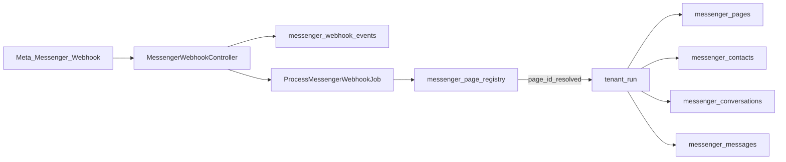

# Messenger Messaging Module Documentation

Developer handoff document for the **Facebook Messenger** CRM channel in the Techno Online Store multi-tenant platform.

**Status:** Phase **D complete** (tenant Filament Pages + Inbox + Webhooks). Phases E–G not started.  
**Branch:** `feature/messenger-integration`  
**Related:** WhatsApp is a separate channel — see [`docs/whatsapp-messaging-module.md`](whatsapp-messaging-module.md). Do not mix tables, services, or routes.

---

## Changelog

| Date | Change |
|---|---|
| 2026-07-12 | Phase D implemented: tenant Filament `MessengerPageResource`, `MessengerInboxPage`, `MessengerWebhookEventResource` (tenant-scoped, read-only). Manual page connect with masked token; inbox reply via Phase C send + 24h policy. No Admin UI / OAuth. |
| 2026-07-12 | Phase C implemented: `MessengerGraphApiService`, `MessengerSendingPolicyService`, `SendMessengerTextMessageAction` (text only, 24h window, auth → reconnect_required). No Filament UI / OAuth / tags / campaigns. API request DB logging skipped. |
| 2026-07-12 | Phase B implemented: Messenger webhook routes/controller, signature verify, central event store, `ProcessMessengerWebhookJob`, page_id resolver, inbound text processor (contact/conversation/message + 24h window), diagnostics statuses, Phase B tests. No send/UI/OAuth. |
| 2026-07-12 | Phase A implemented: central/tenant migrations, models, enums, registry sync observer, permission keys, Phase A tests. No webhooks/UI/send yet. |
| 2026-07-12 | Full Messenger implementation plan documented. No application code. Awaiting separate approval before Phase A (schema). |

---

## Phase D delivered

### Tenant Filament UI
- **Pages:** `App\Filament\Tenant\Resources\MessengerPages\MessengerPageResource` (+ Create/Edit/List)
  - Manual connect: `page_id`, `page_name`, `page_access_token` (password, never revealed full), status, webhook_status, is_default, is_active
  - Diagnostics (edit): last inbound/outbound/error, connected/disconnected/reconnect timestamps
  - Empty token on edit keeps existing encrypted token; registry sync via existing observer (no token centrally)
  - Actions: set default, disable, disconnect (keeps conversations/messages)
- **Inbox:** `App\Filament\Tenant\Pages\MessengerInboxPage` + shared concern/view
  - Conversation list + thread; page name; PSID/profile name; 24h open/closed badge
  - Reply only when `MessengerSendingPolicyService` allows; uses `SendMessengerTextMessageAction`
  - Outside window: clear alert, **no Graph call**; no tags/campaigns/attachments/cold outbound
- **Webhooks:** `App\Filament\Tenant\Resources\MessengerWebhookEvents\MessengerWebhookEventResource`
  - Central `MessengerWebhookEvent` filtered to current `tenant_id`; read-only; filters status/page_id/event_type

### Shared / nav
- `App\Filament\Shared\Messenger\...` (form, tables, permission + inbox concerns)
- Navigation group `dashboard.messenger_group` (sort 50–52); WhatsApp nav untouched
- Permissions: `messenger.view_pages`, `manage_pages`, `view_inbox`, `send_messages`, `view_webhook_events` (bypass respected via `ChecksMessengerPermissions` / Gate)

### Not in Phase D
Admin Messenger UI, Facebook Login, reprocess webhook action, Instagram, Orders, campaigns, WhatsApp changes.

---

## Phase C delivered

### Services / actions
- `App\Messenger\Services\MessengerGraphApiService` — `POST /{page-id}/messages` text send; Graph version from `config/messenger.php`; never logs `page_access_token`
- `App\Messenger\Services\MessengerSendingPolicyService` — freeform text only inside open 24h window; blocks inactive/disabled/reconnect_required/failed pages and page/conversation mismatch
- `App\Messenger\DTOs\MessengerSendingPolicyResult`
- `App\Messenger\Actions\SendMessengerTextMessageAction` — policy → Graph → persist outbound message → update conversation/page → registry sync

### Send flow (service level)
1. Resolve `messenger_page` from conversation (tenant DB token only)
2. `canSendText` must allow (active page + ownership + window open)
3. Create pending outbound `messenger_messages` row
4. Graph send with Page access token (`messaging_type: RESPONSE`)
5. On success: mark sent, update previews/`last_outbound_at`, sync registry metadata
6. On Graph auth error (HTTP 401 or codes 190/102): page → `reconnect_required`, set `reconnect_required_at` + safe `last_error_message`, sync registry; message → failed
7. Outside window / bad page → exception **before** Graph call

### Not in Phase C
Filament inbox/UI, Facebook Login, message tags, cold outbound, attachments, Instagram, Orders, campaigns, WhatsApp changes, API request DB log table.

---

## Phase B delivered

### Routes (`routes/web.php`)
- `GET /webhooks/meta/messenger` — Meta verification (`hub.mode` / `hub.verify_token` / `hub.challenge`, underscore fallback)
- `POST /webhooks/meta/messenger` — receive + enqueue processing

### Controller
- `App\Http\Controllers\MessengerWebhookController`
- Verify token from `MESSENGER_WEBHOOK_VERIFY_TOKEN` (`config/messenger.php`)
- POST verifies `X-Hub-Signature-256` with `META_APP_SECRET`
- Invalid signature → central event `rejected`, HTTP 403
- Valid body → store `messenger_webhook_events` (`pending`), dispatch job, HTTP 200

### Job / resolver / inbound
- `App\Messenger\Jobs\ProcessMessengerWebhookJob`
- `App\Messenger\Services\MessengerWebhookResolver` — resolve tenant by `page_id` from `messenger_page_registry` only (never trust payload `tenant_id`)
- `App\Messenger\Actions\ProcessInboundMessengerMessageAction` (+ upsert contact, find/create conversation, open 24h window, registry sync)
- Idempotent on `provider_message_id` (`message.mid`)
- Statuses: `pending`, `processed`, `failed`, `unresolved`, `rejected`
- Unresolved unknown `page_id`; failed stores safe `error_message`; payloads redacted per retention

### Config / env
- `config/messenger.php`
- `MESSENGER_WEBHOOK_VERIFY_TOKEN`, `MESSENGER_ALLOW_UNSIGNED_WEBHOOKS`, shared `META_APP_SECRET`

### Not in Phase B
Send API, outbound replies, Filament inbox/pages, Facebook Login, Instagram, Orders, campaigns, WhatsApp changes.

---

## Phase A delivered

### Central tables
- `messenger_page_registry` — routing/metadata only (no tokens)
- `messenger_webhook_events` — schema ready; **no processing** until Phase B

### Tenant tables
- `messenger_pages`, `messenger_contacts`, `messenger_conversations`, `messenger_messages`

### Models
- Central: `App\Models\MessengerPageRegistry`, `App\Models\MessengerWebhookEvent`
- Tenant: `App\Models\Tenant\MessengerPage`, `MessengerContact`, `MessengerConversation`, `MessengerMessage`

### Enums (`App\Messenger\Enums\`)
- `MessengerPageStatus`, `MessengerWebhookProcessingStatus`, `MessengerTokenSource`, `MessengerConnectionMethod`
- `MessengerMessageDirection`, `MessengerMessageStatus`, `MessengerMessageType`, `MessengerMessageSenderType`
- `MessengerConversationStatus`

### Sync
- `App\Observers\Tenant\MessengerPageObserver`
- `App\Messenger\Actions\SyncMessengerPageRegistryAction`

### Permissions
- Tenant: `messenger.view_pages`, `manage_pages`, `view_inbox`, `send_messages`, `view_webhook_events`
- Admin: `messenger.platform.view_all_pages`, `manage_all_pages`, `view_webhook_events`, `troubleshoot`

### Not in Phase A
Webhooks, routes, controllers, jobs, send API, Filament UI, Facebook Login.

---

## 1. Purpose

Build Messenger integration so each merchant (tenant) can:

- Connect one or more **Facebook Pages**
- Receive inbound Messenger messages via Meta webhooks
- Reply from the tenant CRM inbox
- Create/update contacts from Messenger interactions (PSID)
- Keep all operational Messenger data isolated in the tenant database

**Billing assumption:** Merchants own their Facebook Page / Meta assets; the platform stores Page access tokens only for messaging (same model as WhatsApp).

### Explicit non-goals (this initiative)

- Do **not** modify the WhatsApp module or its tables
- Do **not** implement Instagram yet (design for a similar future pattern only)
- Do **not** implement Orders or order notifications
- Do **not** implement campaigns / bulk sending
- Do **not** change queue architecture
- Do **not** change the hybrid central + tenant storage architecture
- Do **not** create a central operational inbox of conversations/messages

---

## 2. Business requirements

| Requirement | Decision |
|---|---|
| Multi-page per tenant | Supported |
| Inbound → CRM | Via global webhook + registry routing |
| Outbound from CRM | Page access token + Send API to PSID |
| Contacts | Upsert from interactions only — **no** Page follower import |
| Tenant isolation | Mandatory (DB + services + Filament) |
| Admin access | Tenant selector + initialize tenant context (like WhatsApp admin inbox) |
| Connection MVP | Manual `page_id` + `page_name` + `page_access_token` |
| Later onboarding | Facebook Login + Page selection + webhook subscribe (Phase G) |
| Manual path | Remains for admins/developers |

---

## 3. Architecture decision: Hybrid central + tenant DB

Mirror the WhatsApp hybrid approach. Meta delivers webhooks to **one global HTTPS endpoint** before the app knows which tenant owns the `page_id`.



### Central DB stores

| Table / data | Purpose |
|---|---|
| `messenger_page_registry` | Maps `page_id` → `tenant_id` + tenant-local page ID |
| `messenger_webhook_events` | Raw/minimized payloads, processing status, diagnostics |
| Registry metadata | Connection/health flags (no tokens) |
| Unresolved events | Unknown or unmapped `page_id` |

### Tenant DB stores (per merchant)

| Table | Purpose |
|---|---|
| `messenger_pages` | Connected Pages + **encrypted** Page access tokens |
| `messenger_contacts` | Customers keyed by PSID |
| `messenger_conversations` | Inbox threads + 24h window |
| `messenger_messages` | Inbound/outbound timeline |
| Future | Tenant Messenger settings / optional API request logs |

### Why hybrid?

```
Meta webhook (global URL)
  → store event centrally
  → resolve page_id in central registry
  → tenancy()->initialize($tenant) / $tenant->run()
  → write conversation/message in that tenant’s DB
```

### Explicit architectural decisions

1. **Separate channel namespaces** — do not reuse WhatsApp tables or `App\WhatsApp\*` services.
2. **No central mirror** of conversations or messages.
3. **Resolve tenant only by `page_id`** — never trust `tenant_id` from the webhook payload.
4. **Tokens only in tenant DB**, encrypted, hidden, masked in UI.
5. **Duplicate channel code** under `App\Messenger\*`; share only thin utilities (e.g. HMAC signature verify pattern) if extracted safely.
6. Staging may keep `QUEUE_CONNECTION=sync`; production can use database/redis later — **no architecture change required for MVP**.

---

## 4. WhatsApp pattern reuse

| Pattern | Reuse as |
|---|---|
| Registry sync observer | `MessengerPageObserver` → `SyncMessengerPageRegistryAction` |
| Webhook ingest | Controller → central event → job → resolve → `$tenant->run()` |
| 24h customer service window | Same idea on `messenger_conversations` |
| Token encryption / mask / empty-on-edit keep | Same UX and casts on `page_access_token` |
| Admin tenant selector | Same init/end safety as WhatsApp admin pages |
| Message status transitions | Delivery/read if subscribed (no downgrade) |
| Human-readable webhook interpretation | Optional parallel to WhatsApp event logging |
| Permission bypass during development | Same `BYPASS_PERMISSIONS` project rule |

**Do not generalize** into a single “omni-channel” module in this phase.

---

## 5. Data model (planned)

### Central: `messenger_page_registry`

- `tenant_id`, `tenant_messenger_page_id`
- `page_id` (unique globally), `page_name` nullable
- `status`, `webhook_status`, `is_default`, `is_active`
- `last_inbound_at`, `last_outbound_at`, `last_health_check_at`
- Optional non-secret mirrors: `connection_method`, `token_source`
- **No `page_access_token`**

### Central: `messenger_webhook_events`

- `provider` default `meta`
- `event_type`, `page_id`, `tenant_id`
- `processing_status`: `pending` | `processed` | `failed` | `unresolved` | `rejected`
- `payload`, `original_payload`, `payload_redacted`
- `summary`, `interpretation` (human-readable)
- `signature_valid`, `diagnostic_data`, `error_message`, `processed_at`

### Tenant: `messenger_pages`

Required fields:

- `page_id`, `page_name`
- `page_access_token` (encrypted)
- `token_source` (MVP: `manual`)
- `connection_method` (MVP: `manual`)
- `status` (`active` | `disabled` | `reconnect_required` | `failed`)
- `webhook_status`, `is_default`, `is_active`
- `last_inbound_at`, `last_outbound_at`, `last_error_message`
- Recommended: `connected_at`, `disconnected_at`, `reconnect_required_at`

### Tenant: `messenger_contacts`

- `psid` (unique), `profile_name` nullable
- Optional profile picture URL only if Meta permissions allow and product needs it
- `last_message_at`

### Tenant: `messenger_conversations`

- Unique `(messenger_page_id, sender_psid)`
- Optional `contact_id`, assignment, status
- Previews + `customer_service_window_expires_at` / `last_customer_message_at`

### Tenant: `messenger_messages`

- Conversation + page FKs, direction, type, body
- `provider_message_id` (mid), status, timestamps, safe error fields
- Idempotent on inbound mid

---

## 6. Webhook flow

**Routes (new; WhatsApp routes untouched):**

- `GET /webhooks/meta/messenger` — verification
- `POST /webhooks/meta/messenger` — receive

**GET:** Validate `hub.mode` / `hub.verify_token` / `hub.challenge` against `MESSENGER_WEBHOOK_VERIFY_TOKEN` (dedicated env; preferred).

**POST:**

1. Verify `X-Hub-Signature-256` with `META_APP_SECRET`
2. Store central `messenger_webhook_events` (`pending`, keep `original_payload`)
3. Extract `page_id` from `entry[].id` (`object: page`)
4. Dispatch `ProcessMessengerWebhookJob` (works under `QUEUE_CONNECTION=sync`)
5. Return 200

**Job:**

1. Resolve registry by `page_id` → else `unresolved`
2. `$tenant->run()`: load page, upsert contact (PSID), find/create conversation, store message, open 24h window
3. Mark `processed` + redact per retention policy; on exception → `failed`

Subscribe Page fields (Meta App Dashboard): at minimum `messages`; add deliveries/reads/postbacks as phases require.

---

## 7. Sending flow

**Phase C (implemented at service/action layer — no Filament UI yet):**

1. Caller invokes `SendMessengerTextMessageAction` with a `MessengerConversation` + text body (+ optional acting user for sender_type)
2. Page resolved from conversation; Page access token read from **tenant** `messenger_pages` only
3. `MessengerSendingPolicyService::canSendText` — active page, conversation ownership, **inside 24h window**
4. Outside window → **block freeform before Graph**; no message tags / campaigns in this initiative
5. `MessengerGraphApiService::sendText` → `POST /{page-id}/messages` (`messaging_type: RESPONSE`)
6. Persist outbound message; update conversation; sync registry metadata (no token centrally)
7. Auth failures → `reconnect_required` + `reconnect_required_at` (never log the token)

Reply-page switching remains a later enhancement; tenant inbox UX is delivered in Phase D (text replies only).

---

## 8. Contact sync behavior

| Do | Do not |
|---|---|
| Upsert contact on Messenger interactions | Import all Page followers/fans |
| Store **PSID** as provider identifier | Assume phone/email exists |
| Use webhook profile name when present | Call Graph profile unless permissions + product need it |

---

## 9. Multi-page per tenant

- Multiple Facebook Pages per tenant
- One default page (`is_default`) for entry points that need a default
- Conversation identity = **`messenger_page_id + sender_psid`**
- Same person messaging two Pages = two conversations
- Switching reply page creates/finds the correct conversation (WhatsApp reply-number parallel)
- `page_id` unique in central registry across the platform

---

## 10. Onboarding / connection methods

### MVP — Manual

Filament form: `page_id`, `page_name`, `page_access_token`  
Defaults: `token_source=manual`, `connection_method=manual`  
Observer → central registry sync (metadata only)

### Later — Facebook Login / Page selection (Phase G)

1. Merchant Facebook Login  
2. Grant page permissions  
3. List manageable Pages  
4. Select page(s)  
5. Store long-lived **Page** access token  
6. Subscribe Page to app webhooks  
7. Mark active (+ optional test send)

Manual connection **remains** for development and admin support.

---

## 11. Permissions (planned keys)

### Tenant

- `messenger.view_pages`
- `messenger.manage_pages`
- `messenger.view_inbox`
- `messenger.send_messages`
- `messenger.view_webhook_events`

### Admin (platform)

- `messenger.platform.view_all_pages`
- `messenger.platform.manage_all_pages`
- `messenger.platform.view_webhook_events`
- `messenger.platform.troubleshoot`

During active development, project may still use `BYPASS_PERMISSIONS` — feature behavior first; wire `can*()` in a hardening pass (same rule as WhatsApp).

---

## 12. Filament UI (planned)

### Tenant panel (`/app`)

- `MessengerPageResource` — manual connect CRUD, default, disconnect
- `MessengerInboxPage` — conversations + thread + reply
- `MessengerWebhookEventResource` — filtered to current `tenant_id`

### Admin panel (`/admin`)

- `MessengerPageRegistryResource` — list / enable / disable (**no tokens**)
- `MessengerWebhookEventResource` — all tenants + filters
- `MessengerInboxPage` — **requires tenant selector**; initialize/end tenant context

---

## 13. Security

- Encrypt `page_access_token`; `$hidden`; mask in UI; empty token on edit keeps existing
- Never store tokens in central DB or webhook payloads retained longer than needed
- Never log Authorization headers or raw tokens
- Signature verification required when `META_APP_SECRET` is set
- Resolve tenant **only** via `page_id` → `messenger_page_registry`
- Dedicated Messenger verify token recommended

---

## 14. Tests (planned)

| Area | Assert |
|---|---|
| Webhook verification | Valid challenge / invalid 403 |
| Inbound | Contact + conversation + message + window open |
| Duplicate mid | No duplicate messages |
| Unresolved `page_id` | Event unresolved; no tenant write |
| Tenant isolation | Cross-tenant invisibility |
| Send inside 24h | Allowed + Graph fake |
| Send outside 24h | Policy deny; no Graph call |
| Token | Hidden + encrypted; absent from registry |
| Admin selector | No tenant DB access before init; cleanup on switch |

WhatsApp test suite must remain green; do not couple Messenger tests into WhatsApp code.

---

## 15. Instagram future compatibility (not implemented)

When Instagram is added later, mirror the same hybrid shape:

| Messenger (now) | Instagram (future) |
|---|---|
| `messenger_page_registry` | `instagram_account_registry` |
| `messenger_webhook_events` | `instagram_webhook_events` |
| `messenger_pages` | `instagram_accounts` |
| contacts / conversations / messages | same pattern with IG identifiers |

Do **not** create Instagram tables or routes in this initiative.

---

## 16. Implementation phases

| Phase | Scope | Exit criteria |
|---|---|---|
| ~~**A**~~ | ~~Migrations, enums, models, observer + registry sync, permission keys~~ | **Done** |
| ~~**B**~~ | ~~Routes, controller, signature/verify, job, inbound processor, contact upsert, window~~ | **Done** |
| ~~**C**~~ | ~~Graph send service, send action, 24h policy, outbound persistence~~ | **Done** |
| ~~**D**~~ | ~~Tenant Filament Pages + Inbox + Webhook events~~ | **Done** |
| **E** | Admin registry + webhook events + inbox with tenant selector | Support without central ops inbox |
| **F** | Full tests + doc polish + staging checklist | Green tests; docs current |
| **G** | Facebook Login + page picker + subscribe (later) | Self-serve connect; manual remains |

**Execution rule:** One phase at a time. After each phase: update this document (including Changelog) and run tests.  
**Current gate:** Phase D complete. **Do not start Phase E until separately approved.**

---

## 17. Planned code map (when implementation starts)

```
app/Messenger/...
app/Models/Tenant/Messenger*.php
app/Models/MessengerPageRegistry.php
app/Models/MessengerWebhookEvent.php
app/Http/Controllers/MessengerWebhookController.php
app/Filament/Tenant/.../Messenger*
app/Filament/Resources/.../Messenger*          # admin
app/Filament/Shared/Messenger/...
database/migrations/*messenger_page_registry*
database/migrations/*messenger_webhook_events*
database/migrations/tenant/*messenger_*
config/messenger.php
routes/web.php                                 # add messenger webhook routes only
tests/Feature/Messenger/...
tests/Unit/Messenger/...
```

---

## 18. Risks

| Risk | Mitigation |
|---|---|
| Mixing WhatsApp and Messenger data | Separate tables + `App\Messenger` namespace |
| Page token vs user token confusion | Document manual long-lived Page token steps |
| Page not subscribed → silence | Registry + webhook diagnostics + unresolved UX |
| Multi-page same PSID | Clear reply-page UI; conversation per page |
| Outside-24h Meta rejection | Policy blocks before Graph call |
| Accidental WhatsApp edits | Code review rule: no WhatsApp file changes in Messenger PRs |

---

## 19. Meta / environment checklist

- [ ] Meta App has Messenger product enabled
- [ ] Callback URL: `https://{central-domain}/webhooks/meta/messenger`
- [ ] `MESSENGER_WEBHOOK_VERIFY_TOKEN` set and matches App Dashboard
- [ ] `META_APP_SECRET` set; unsigned webhooks disabled in staging/production
- [ ] Page subscribed to the app; fields include `messages` (+ statuses as needed)
- [ ] Long-lived **Page** access token procedure for manual MVP
- [ ] Graph API version chosen via env (align with current Meta when implementing)
- [ ] App Review / permissions clarified for production messaging
- [ ] Facebook Login / Page onboarding requirements documented before Phase G

---

## 20. Final status

| Item | Status |
|---|---|
| Messenger module | **Phase D complete** |
| Implementation | Tenant Pages + Inbox + Webhook viewer; send uses Phase C services. No Admin UI/OAuth yet |
| Phase E (Admin UI) | **Blocked** until separate approval |
| WhatsApp module | **Unchanged** — separate channel |
| Instagram | **Not in scope** |
| Orders / campaigns | **Not in scope** |

---

*Document version: 2026-07-12 — Phase D. Stack: Laravel 13, Filament ~5, stancl/tenancy, spatie/laravel-permission.*
